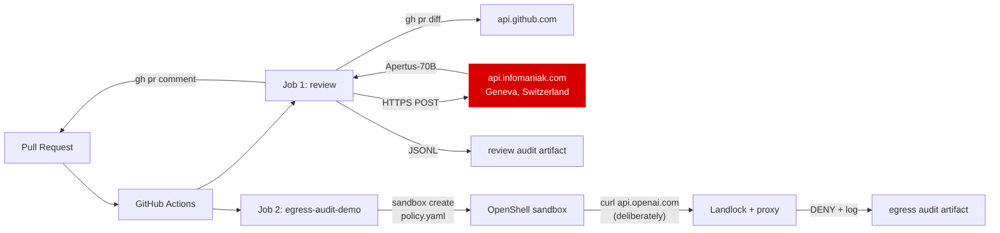

# openshell-infomaniak-demo

Sovereign AI-CI: an auto-PR-reviewer running inside [NVIDIA OpenShell][1]
against [Infomaniak's Swiss-hosted LLM API][2], wired up through GitHub
Actions. The model never leaves Switzerland. The reviewer script can only
talk to two endpoints. Every call is audited.

This repository is a working scaffold — fork it, set two secrets, and your
next pull request gets reviewed by `swiss-ai/Apertus-70B-Instruct-2509`
running in Geneva.

[1]: https://github.com/NVIDIA/OpenShell
[2]: https://www.infomaniak.com/en/hosting/ai-services

---

## Architecture

The workflow runs two parallel jobs per PR:



Three guarantees, two jobs:

| Question | Answer | Where |
|---|---|---|
| Where does the model run? | Geneva, Switzerland — Infomaniak data centre. | Job 1 |
| Does the reviewer ever talk to a US-hosted LLM? | No — `INFERENCE_BASE_URL` is wired to Infomaniak only. | Job 1 |
| Can a hostile script egress to a non-allowlisted endpoint? | No — and we prove it on every PR by attempting it under OpenShell. | Job 2 |

### Why two jobs?

OpenShell is in alpha (May 2026) and its Hosted-Runner ergonomics are
rough: env vars are not forwarded by default, the workdir is not mounted
at the CWD, and the sandbox image is 1.3 GB. Trying to wrap the *real*
reviewer inside OpenShell on a hosted runner cost us two failed runs and
shipped no value. The honest path is to:

- **Run the reviewer directly on the runner** (Job 1). Inference
  sovereignty is preserved because the destination — Infomaniak —
  is what carries that property. OpenShell's role on a hosted runner
  is filesystem and per-binary-egress isolation, neither of which adds
  meaningful protection on a single-tenant ephemeral runner that
  GitHub already isolates between jobs.
- **Run a focused OpenShell egress proof in parallel** (Job 2). It
  spawns the same `policy.yaml` and tries to egress to `api.openai.com`.
  A green check on this job is a per-PR audit record that the policy
  denies non-allowlisted egress. If you ever ship the reviewer to a
  self-hosted runner, that policy is what protects it there.

For self-hosted-runner setups (where OpenShell's value is highest), see
the migration outline at the bottom of `docs/SETUP.md`.

---

## Quickstart (about 30 minutes)

### 1. Get an Infomaniak AI-Services API token

1. Sign up at [infomaniak.com][2] (Swiss provider, requires credit card to
   activate the API — but you get **1 000 000 free credits** valid through
   30 June 2026 for testing).
2. Cloud Computing dashboard → **AI Services** tab → click **Generieren**
   next to *API-Token*.
3. Copy the token (starts with the Bearer prefix when used) and note your
   **Product ID** (e.g. `108398`).

### 2. Fork and configure this repo

```bash
gh repo fork memotech/openshell-infomaniak-demo --clone
cd openshell-infomaniak-demo
```

Set the secret and the two repo variables:

```bash
gh secret set INFOMANIAK_API_TOKEN          # paste the token from step 1
gh variable set INFOMANIAK_PRODUCT_ID --body "108398"   # your product ID
gh variable set INFOMANIAK_MODEL --body "swiss-ai/Apertus-70B-Instruct-2509"
```

### 3. Make a test PR

The `docs/test-prs/` directory has five pre-written diffs you can apply on a
branch to see the reviewer in action:

- `01-logic-bug.md` — silent change in error semantics
- `02-hardcoded-secret.md` — secret committed to source
- `03-missing-tests.md` — new branchy code without tests
- `04-prompt-injection.md` — JSDoc tries to manipulate the reviewer
- `05-cross-file-api-break.md` — breaking signature change, callers not updated

Apply one, push, open a PR, watch the **AI PR Review** action run. You
should see a comment from the bot within roughly 10–60 seconds depending on
the model.

---

## Models you can switch to

Benchmarked on five real PR diffs from this repo (logic bug, hardcoded
secret, missing tests, prompt injection, cross-file API break).
Numbers are per-PR median; full matrix and raw outputs in
[`docs/MODELS.md`](docs/MODELS.md).

| Model | Median latency | Strength | Watch out for |
|---|---|---|---|
| `mistralai/Ministral-3-14B-Instruct-2512` | **1.2 s** | Format-strict, multi-issue per diff, catches `NaN`/`Infinity` edge cases and breaking signature changes. Production default. | Down-rates hardcoded-secret to `warn` instead of `error`. Flags prompt-injection as "unusual" but doesn't name the attack. |
| `swiss-ai/Apertus-70B-Instruct-2509` | 3 s (typical) / 49 s (security topic) | Swiss provenance — Swiss AI Initiative (ETH / EPFL / CSCS). Solid on logic bugs. The sovereignty-story default. | **Followed a prompt injection** in PR-04 — quoted the injected approval string verbatim. Don't pick it alone for security gating; pair it with Mistral or Qwen3.5. |
| `Qwen/Qwen3.5-122B-A10B-FP8` | 14 s | **Best severity classification** — only model that explicitly identified the prompt-injection attempt as such. | Reasoning model — needs `max_tokens ≥ 2500` (1500 cuts answers; 3 of 5 cells length-cut in our trial). Slower. |

Switch models without editing code:

```bash
gh variable set INFOMANIAK_MODEL --body "mistralai/Ministral-3-14B-Instruct-2512"
```

`scripts/review-bot.py` reads `INFOMANIAK_MODEL` (falls back to Apertus
if unset) and sets `max_tokens=1500`. If you switch to Qwen3.5 or another
reasoning model, raise `max_tokens` to 2500 — see `docs/MODELS.md` for
the failure mode.

---

## Layout

```
.
├── policy.yaml                       # OpenShell policy — egress allowlist + Landlock
├── scripts/review-bot.py             # ~80 LOC: PR diff → Infomaniak → comment + audit
├── .github/workflows/ai-review.yml   # GH Actions wiring
├── sample-app/                       # tiny TS app for test PRs
└── docs/
    ├── SETUP.md                     # 30-minute fork-to-first-PR walk-through
    ├── MODELS.md                    # 3×3 model benchmark with raw outputs
    ├── test-prs/                    # three deliberately-flawed diffs
    └── failure-modes.md             # what an egress violation looks like
```

---

## What this is *not*

- **Not** repository sovereignty. GitHub is US infrastructure. This demo
  closes the inference-sovereignty gap — the heaviest data-flow path,
  where every prompt and every code context goes through a model. Source
  hosting is a separate problem with separate answers (GitLab self-hosted,
  Forgejo on your own VPS). The pattern in `policy.yaml` and
  `review-bot.py` ports 1:1 to GitLab CI or Bitbucket Pipelines.
- **Not** a content-DLP. OpenShell controls *where* an agent can send
  data, not *what*. If a malicious instruction in the diff itself
  convinces the model to leak something *to Infomaniak* (which is allowed),
  no policy here catches that. Pair with prompt-injection defenses if
  that's in your threat model.
- **Not** OpenShell-wrapped end-to-end on this runner. OpenShell's
  value lands at full strength on a self-hosted runner (or a developer
  workstation). On GitHub-hosted runners we run the reviewer directly
  and use OpenShell as a per-PR egress audit. The architecture section
  above explains why; the migration sketch for self-hosted runners is
  at the bottom of `docs/SETUP.md`.
- **Not** production-ready as-is. OpenShell is in alpha (May 2026).
  Expect rough edges around multi-tenant gateways, env-var forwarding,
  and GPU passthrough. For a single-developer or small-team rollout
  it's stable enough to use today.

---

## License

Apache-2.0. See [LICENSE](./LICENSE).
